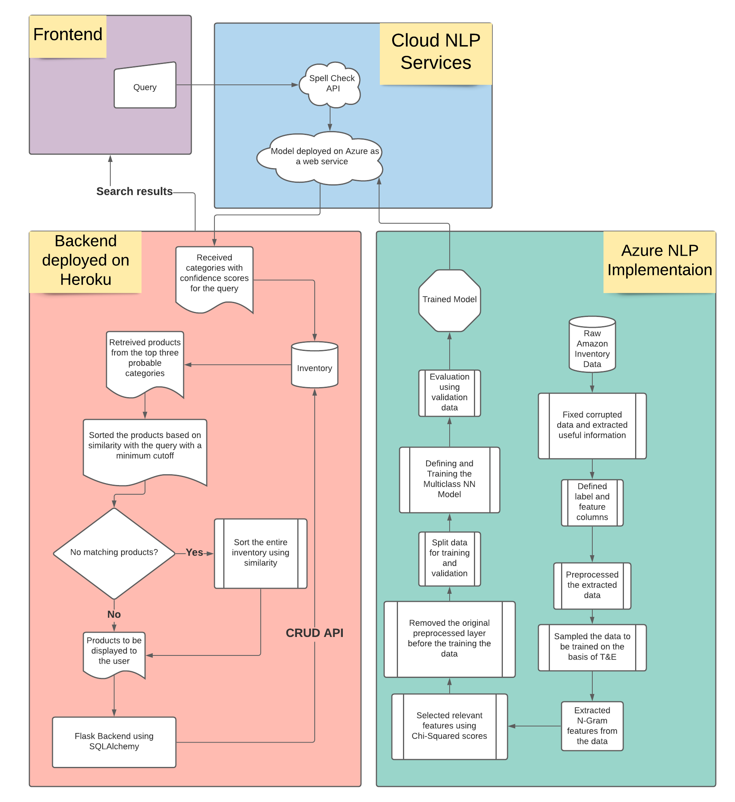
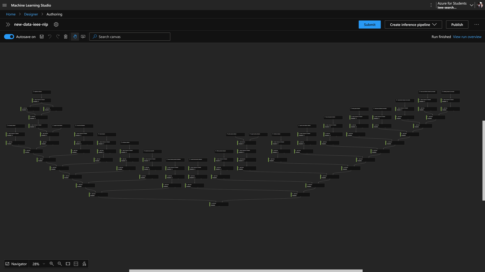
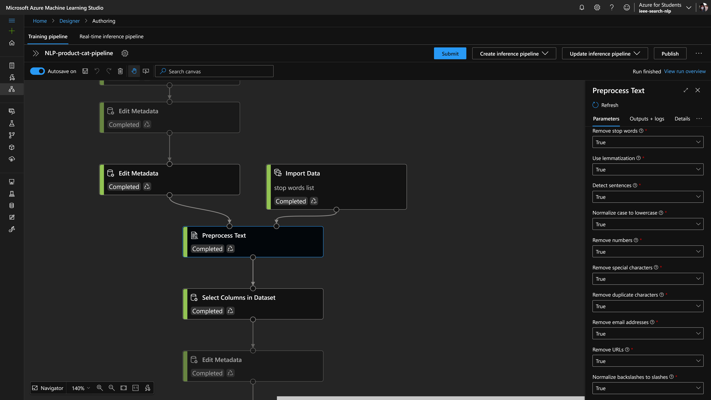
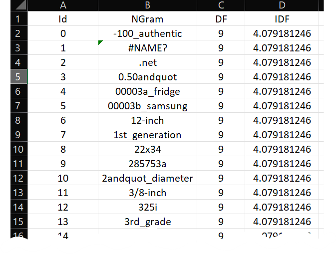
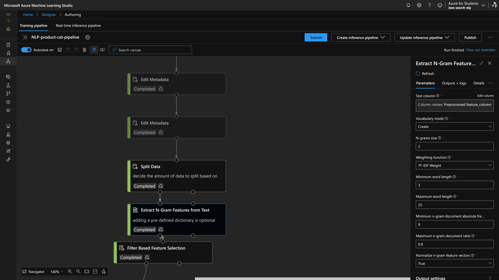
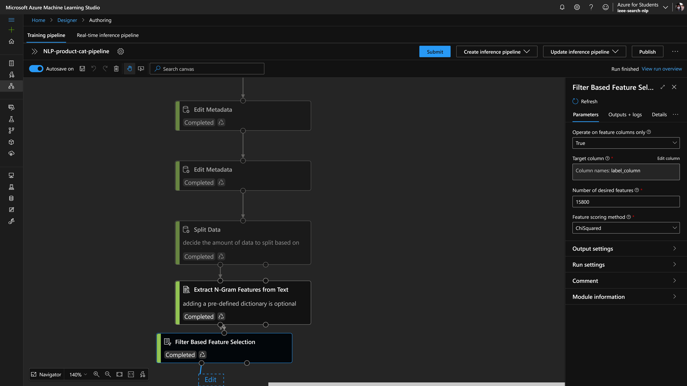
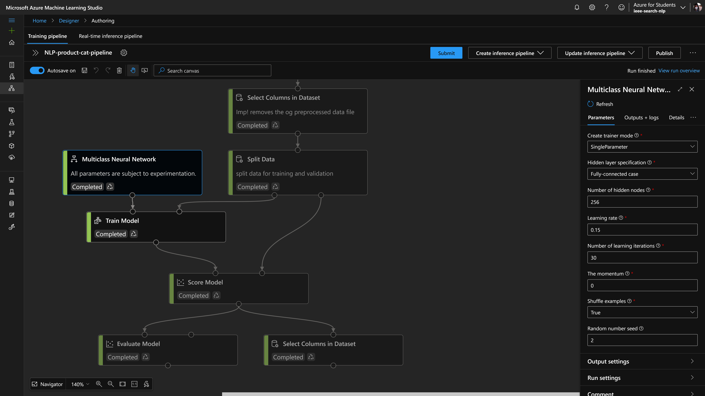
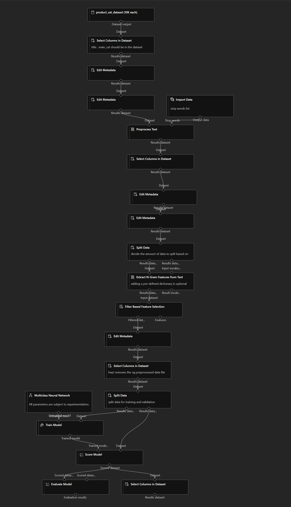
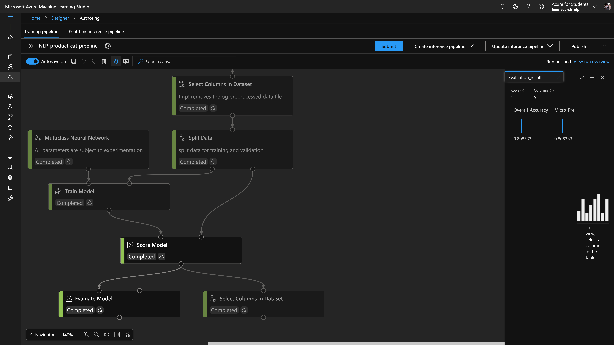
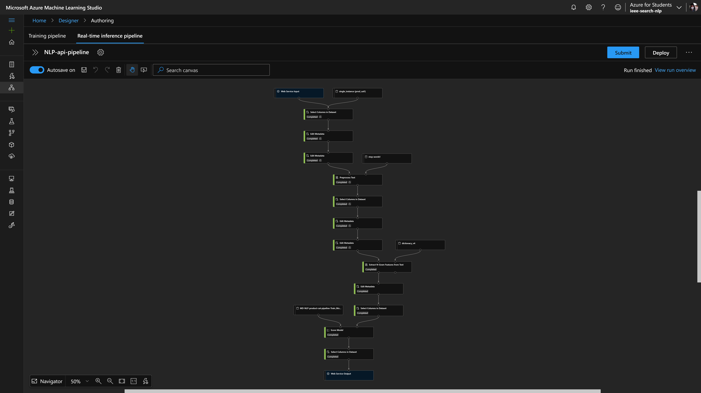

# IEEE-Repo-Reboot 
## *Track: NLP Based Search Engine for an E-Commerce Website*
 

*Deployed Website* : https://easybuy-nlp.herokuapp.com/
 
 

***

## Installation

1. In your terminal, navigate to the directory where you want to install the repository  

2. Clone the repository  
`git clone https://github.com/kid-116/IEEE-Repo-Reboot.git`

3. Navigate to the flask_server  
`cd IEEE-Repo-Reboot//flask_server`

4. Install requirements  
`pip install -r requirements.txt`

5. Create .env file  

6. Start the server  
`flask run`
7. Go to [localhost:5000](http://localhost:5000) to see the website  
`http://localhost:5000`

***

## Search Implementation
1. A query input is taken by the user and passed to a spell check API.
2. If any spelling mistake is detected by the spell check API, the corrected query is displayed to the user with a link to search with the corrected query. 
3. Then the query is passed to the NLP model, trained by us and deployed on Azure. 
4. The NLP model returns the categories with confidence scores and we select the top 3 categories.
5. All the products within the 3 categories are retrieved from the [SQLAlchemy](https://flask-sqlalchemy.palletsprojects.com/en/2.x/) database.
6. The products are sorted using [thefuzz](https://github.com/seatgeek/thefuzz) python package and a list of products with a high string similarity score is returned.
7. If no relevant products are found within the categories, a string similarity search is done on the entire database.
  

 

***

## [Website](https://easybuy-nlp.herokuapp.com/)
We have created a simple website which allows the user to browse the inventory and allows admins, who have access to the admin key, to perform CRUD operations on the database. We have used [Bootstrap 5](https://getbootstrap.com/docs/5.0/getting-started/introduction/) to make the website responsive. We used python decorators for authentication middleware to prevent unauthorized access. Dynamic templating was implemented using [Jinja](https://jinja.palletsprojects.com/en/3.0.x/).

***

## Dummy Inventory
We are populating our database using a Kaggle E-commerce dataset using a [python notebook](./dummy_inventory/inventory_creation.ipynb). In the notebook we mapped their categories to the categories defined in our NLP model and inserted them to the databse. We are not uploading images for the dummy products as it would take a lot of data, instead we are using a [random picture service](https://picsum.photos/).

***

## Multi-Class Natural Language Processing Model
To train and deploy a Natural Language Processing Multi-Class Classification Model on Azure ML Studio to determine the category (or set of most probable categories) of the product from the search query thereby reducing the search time for queries on the e-commerce website.

References used : 

- [Documentation](https://docs.microsoft.com/en-us/azure/machine-learning/component-reference/component-reference)

- [Azure ML studio (classic) text classification experiment](https://gallery.azure.ai/Experiment/Text-Classification-Step-1-of-5-data-preparation-3)

- [Azure ML studio (classic) multi-class text classification experiment using NN](https://gallery.azure.ai/Experiment/Multi-class-Text-Classification-using-Neural-Network)

- [Text Analytics with Azure ML studio (classic)](https://www.pluralsight.com/guides/text-analytics-with-azure-machine-learning-studio/)
 

### Steps
0. Finding the proper dataset
1. Data preparation
2. Text preprocessing
3. Feature extraction and selection
4. Train and evaluate model
5. Deploy trained model as web service

***

### Step 0: 
**Dataset link**: [Amazon review data (nijianmo.github.io)](https://nijianmo.github.io/amazon/index.html)

Data used: 10,000 products from each category (filtered through the metadata using collab notebooks in .jsonl (json line format))

**Categories include:**

-	All Beauty
-	Arts, Crafts & Sewing
-	Automotive
-	Books
-	Cell Phones & Accessories
-	Clothing, Shoes and Jewelry
-	Electronics
-	Home and Kitchen
-	Industrial & Scientific
-	Luxury Beauty
-	Musical Instruments
-	Office Products
-	Pantry
-	Software
-	Sports & Outdoors
-	Sports Collectibles
-	Tools & Home Improvement
-	Toys & Games
-	Video Games

***

### Step 1: 
### **Data preparation**
 

 

Due to large size of the dataset, the metadata for each category was downloaded separately. The best way we found was to download datasets directly in an azure [notebook](./nlp_model/data_preparation/parse_and_clean_and_export_meta_data.ipynb). Then extract .json.gz file and convert it to .jsonl (json lines format). Finally export the .jsonl files directly to the azure blob storage where it can be converted to an azure ml datasets.

A separate pipeline was made in azure ml designer only to clean the data and join them together to form a dataset to contain 10K items from each category.

***Caution:*** If the .json.gz file contains single quotes ( ' ) instead of double quotes ( " ) for string implementation, the file cannot be directly converted to .jsonl format. A [solution](./nlp_model/data_preparation/parsing_to_csv.ipynb) was to replace ( ' ) with ( " ) and convert the file to csv format, and then upload it as a dataset.

The final dataset had 2 columns namely *title* and *main_cat* with 10K items from each category.

In pipeline, the *title* was declared as a *non - categorical feature column* and *main_cat* as *categorical label column*.
 
 

***

### Step 2: 
### **Text preprocessing**
 

[Preprocessing](https://swatimeena989.medium.com/beginners-guide-for-preprocessing-text-data-f3156bec85ca) was done on *title (feature column)* and general en-us [stop words](./nlp_model/data_preprocessing/stop_words_english.csv) were also removed.

***Caution:*** Its better to import stopwords in the pipeline as a dataset instead of a file as it might cause issues later during deployment of web service.
 
 

 

***

### Step 3: 
### **Feature extraction and selection**
 

**Create the Word Dictionary**

First, extract the set of [unigrams](https://medium.com/mti-technology/n-gram-language-model-b7c2fc322799) (words) that will be used to train the text model. In addition to the unigrams, the number of documents where each word appears in the text corpus is counted (DF). It is not necessary to create the dictionary on the same labeled data used to train the text model -- any large corpus that fairly represents the frequency of words in the target domain of classification can be used, even if it is not annotated with the target categories.

Dictionary generated by current model: [dictonary v4](./nlp_model/N-gram_feature_extraction/dictionary_v4.csv)

 

 

  

**TF-IDF Calculation**

When the metric word frequency of occurrence (TF) in a document is used as a feature value, a higher weight tends to be assigned to words that appear frequently in a corpus (such as stop-words). The inverse document frequency (IDF) is a better metric, because it assigns a lower weight to frequent words. You calculate IDF as the log of the ratio of the number of documents in the training corpus to the number of documents containing the given word. Combining these numbers in a metric (TF/IDF) places greater importance on words that are frequent in the document but rare in the corpus. This assumption is valid not only for unigrams but also for bigrams, trigrams, etc.

This experiment converts unstructured text data into equal-length numeric feature vectors where each feature represents the TF-IDF of a unigram in a text instance.
  
 

 

Here, **Extract N-Gram Features from Text** module automatically creates dictionary and carries out the TF-IDF calculations.
  

**Feature selection (dimensionality reduction)**

We used the Chi-squared score function to rank the hashing features in descending order, and returned the top 15800 *(value subject to change based on experimentation)* most relevant features with respect to the category label, out of all the extracted unigrams.
  
 

  

***

### Step 4: 
### **Train and evaluate model**
 

A [neural network](https://www.3blue1brown.com/lessons/neural-networks) is a set of interconnected layers. The inputs are the first layer, and are connected to an output layer by an acyclic graph comprised of weighted edges and nodes.

Between the input and output layers you can insert multiple hidden layers. Most predictive tasks can be accomplished easily with only one or a few hidden layers. However, recent research has shown that [deep neural networks (DNN)](https://arxiv.org/pdf/2009.05673.pdf) with many layers can be effective in complex tasks such as image or speech recognition. The successive layers are used to model increasing levels of semantic depth.

The relationship between inputs and outputs is learned from training the neural network on the input data. The direction of the graph proceeds from the inputs through the hidden layer and to the output layer. All nodes in a layer are connected by the weighted edges to nodes in the next layer.

To compute the output of the network for a particular input, a value is calculated at each node in the hidden layers and in the output layer. The value is set by calculating the weighted sum of the values of the nodes from the previous layer. An [activation function](https://medium.com/the-theory-of-everything/understanding-activation-functions-in-neural-networks-9491262884e0) is then applied to that weighted sum.

**Parameters altered for various experimental tests:**

- **Number of hidden nodes:** This option lets you customize the number of hidden nodes in the default architecture. Type the number of hidden nodes. The default is one hidden layer with 100 nodes.

- **The learning rate:** Define the size of the step taken at each iteration, before correction.A larger value for learning rate can cause the model to converge faster, but it can overshoot local minima.

- **Number of learning iterations:** Specify the maximum number of times the algorithm should process the training cases.

***Caution:*** Don't forget to specify a non-zero random seed. This will help you to replicate model training results during experimentaton.

 

 

 

**Published Model Training Pipeline**
  
 
  
***
 

**Current Validation Accuracy of the model :**
 
(as of 23-11-2021 1400 IST)

## 80.833 %

 

 

  
***

### Step 5: 
### **Deploy trained model as web service**
 

Reference: [Designer - deploy a machine learning model](https://docs.microsoft.com/en-us/azure/machine-learning/tutorial-designer-automobile-price-deploy)

***Caution:*** *Create inference pipeline* option won't be visible in the pipeline workspace untill entire model is submitted. ([Related forum](https://docs.microsoft.com/en-us/answers/questions/483466/inference-pipeline-option-not-available.html))
  
 

  

